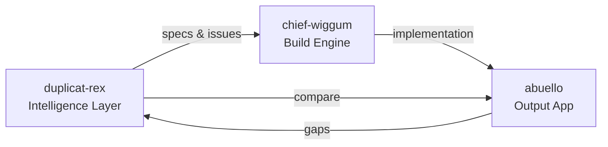
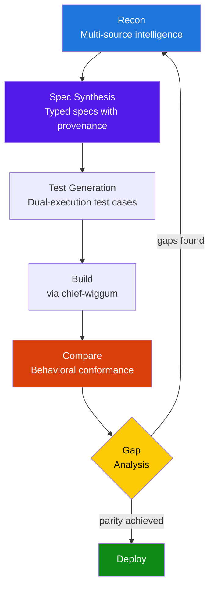
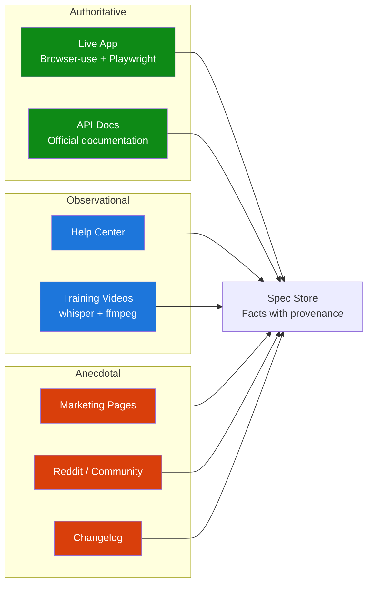
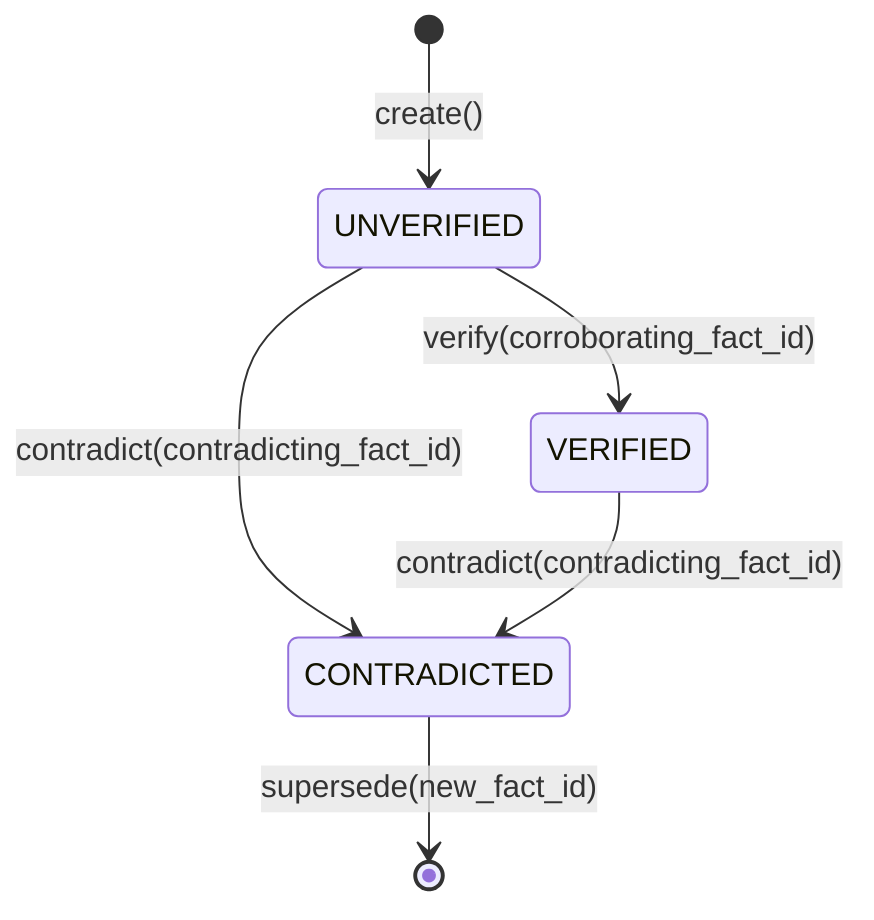

# Duplicat-Rex

Agentic SaaS reverse-engineering engine. Gathers intelligence from every available source, synthesises structured specifications, and drives chief-wiggum's build pipeline to produce full-feature-parity clones.

## What This Repo Is

Duplicat-rex owns the **intelligence pipeline**: reconnaissance, spec synthesis, behavioral comparison, and gap analysis. It does not generate code directly — it produces structured specifications and GitHub issues that chief-wiggum's build pipeline (`/plan-epic`, `/architect`, `/implement-wave`, `/close-epic`) consumes.

Three repos in play:
1. **duplicat-rex** (this repo) — intelligence/recon engine
2. **chief-wiggum** — build engine (configured as skill source)
3. **output repo** (e.g. `plwp/abuello`) — the generated app, one per target



## Tech Stack

- **Language**: Python 3.11+
- **CLI**: Typer
- **AI**: Multi-model (Claude, Codex, Gemini) with structured adjudication
- **Browser automation**: Browser-use + Playwright
- **Transcription**: whisper + ffmpeg + yt-dlp
- **Secrets**: System keychain (never env vars)

## Setup

```bash
# Clone and install
git clone https://github.com/plwp/duplicat-rex
cd duplicat-rex
pip install -e ".[dev]"

# Configure secrets (API keys stored in macOS Keychain)
python3 scripts/keychain.py set ANTHROPIC_API_KEY

# Verify chief-wiggum skills are accessible
# (requires chief-wiggum configured in .claude/settings.local.json)
```

## Usage

```bash
# Recon a target SaaS
/recon trello.com --scope "boards, lists, cards, drag-drop, labels, members, auth"

# Full duplication pipeline (recon → spec → build → compare → loop)
/duplicate trello.com --output plwp/trello-clone --scope "boards, lists, cards"

# Compare clone against target
/compare plwp/trello-clone --target trello.com

# Run gap analysis and feed back into build
/converge plwp/trello-clone --target trello.com
```

Or via the CLI directly:

```bash
duplicat-rex recon trello.com --scope "boards, lists, cards"
duplicat-rex duplicate trello.com --output plwp/trello-clone
```

## Core Loop



### Recon Sources (ranked by authority)



### Fact Lifecycle



See [ARCHITECTURE.md](ARCHITECTURE.md) for full details.

## Development

```bash
# Run tests
pytest

# Lint
ruff check .

# Type check
mypy scripts/
```

## Repo Layout

```
.claude/commands/        # Skills: /recon, /duplicate, /compare, /converge
scripts/
├── recon/               # Recon modules (browser, API docs, videos, community)
├── cli.py               # Typer CLI entry point
├── keychain.py          # Secret management (system keyring)
├── models.py            # Canonical data model (Fact, SpecBundle, enums)
├── scope.py             # Scope parsing + dependency graph
├── spec_store.py        # File-backed spec store with provenance
├── spec_synthesizer.py  # LLM synthesis with provenance (planned)
├── compare.py           # Behavioral conformance testing (planned)
└── gap_analyzer.py      # Gap identification + circuit breaker (planned)
templates/
├── spec-schema.json     # JSON Schema Draft 2020-12 for all entities
└── ...                  # Prompt templates, report formats
tests/                   # 224+ pytest tests
```
